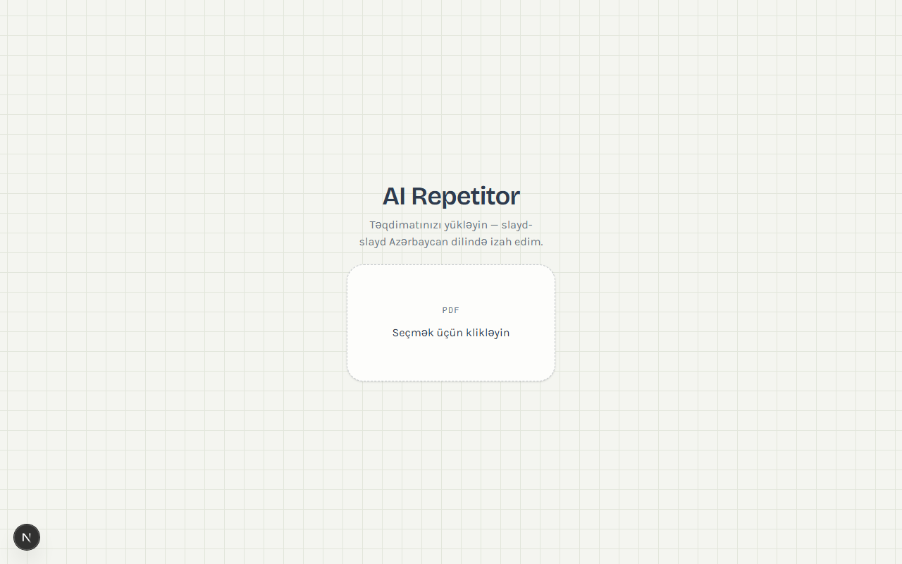
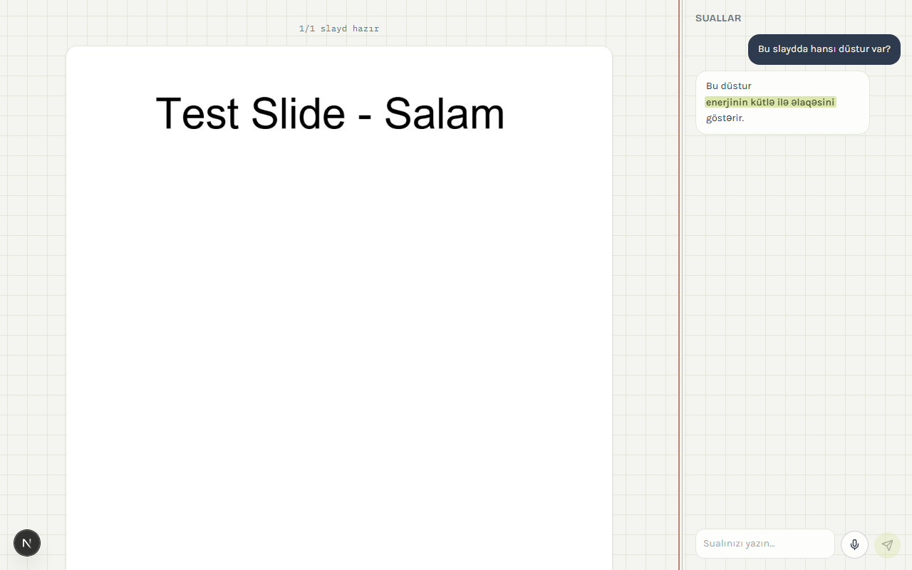
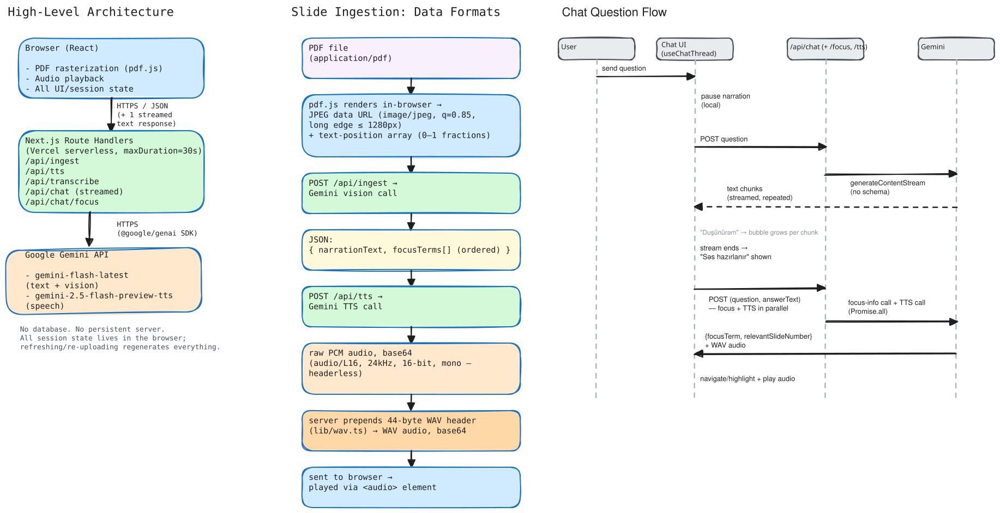

# AI Repetitor

An AI study companion that reads an uploaded presentation aloud in Azerbaijani, slide by slide, and answers spoken or typed questions about it — with the referenced term highlighted in its answer, like a tutor marking up your notebook as they talk.




## What it does

1. **Upload a PDF.** Each page is rasterized to a size/quality-capped image entirely in the browser (no server-side file conversion).
2. **Listen.** Gemini generates a short spoken-style explanation of each slide in Azerbaijani, converts it to speech, and the deck auto-advances as each narration finishes. An on-slide highlight moves between the 2-5 key terms Gemini mentions, roughly timed to narration progress. You can also navigate manually (previous/next), with a soft audio/visual crossfade instead of an abrupt cut.
3. **Ask.** A persistent chat panel lets you type a question or hold the mic to ask by voice — voice is transcribed into the text box first (with the current slide/deck context passed along as a vocabulary hint) so you can review/edit it before sending, rather than firing off a raw audio clip. Sending a question pauses the slide narration immediately so the two don't talk over each other, and the answer streams in progressively rather than appearing all at once.
4. **See the answer, not just hear it.** The AI returns a `focusTerm` and a `relevantSlideNumber` alongside its answer — the specific word/number/formula it's referencing, and which slide it's actually about. Both get rendered as an animated highlighter-marker stroke: in the chat bubble, and positioned directly on the real slide image (derived from the PDF's own text layer, not guessed).
5. **Follow the answer across slides.** If a question is really about a different slide, the app jumps there automatically and highlights it — but narration always stays paused afterward, regardless of whether the jump happened or the question succeeded. Only an explicit click resumes it, and always from the exact position it was paused at, never from the beginning.

## Why it looks the way it does

The visual identity is built around the Azerbaijani/post-Soviet school exercise book (*dəftər*): a faint grid-paper ("kletka") background, and the traditional red vertical margin rule ("sahə xətti") reused literally as the actual divider between the slide viewer and the chat panel — the chat panel *is* the margin column; the AI's answers are marginalia. It's the one deliberately distinctive element; everything else (soft muted palette, generous spacing, quiet type) stays out of its way.

## Tech stack

| Concern | Choice | Why |
|---|---|---|
| Framework | Next.js 16 (App Router) | Route Handlers as a thin HTTP boundary in front of Gemini calls |
| AI | Gemini API (`@google/genai`) | Vision (slide → narration), native TTS, audio understanding (STT), structured JSON output for the answer + focus term |
| PDF rendering | `pdfjs-dist`, client-side | Rasterizing PDFs server-side would need LibreOffice/native canvas — not viable on Vercel serverless. Doing it in the browser sidesteps that entirely |
| Server state | TanStack Query | Per-slide narration/TTS generation is cached (`staleTime: Infinity`) so revisiting a slide never re-triggers a Gemini call |
| Styling | Tailwind CSS 4 | Design tokens (paper/ink/margin/highlight, light+dark) defined as CSS custom properties in `globals.css`, mapped in via `@theme inline` |
| Icons / toasts | `lucide-react`, `sonner` | |

## Architecture

Each Gemini capability gets its own file, not one shared blob:

```
lib/gemini/
  client.ts          shared client singleton, model IDs, the Azerbaijani-only system prompt
  narration.ts        slide image -> spoken-style explanation + ordered key terms
  speech.ts            text -> raw PCM audio (Gemini TTS)
  transcription.ts    spoken audio -> text (with an explicit Azerbaijani-vs-Turkish
                       instruction, since they're close enough that models drift;
                       an optional context string biases recognition of lecture-
                       specific vocabulary)
  chat.ts              streamChatAnswer: question + slide context -> streamed answer text
                       extractChatFocusInfo: question + complete answer -> {focusTerm,
                       relevantSlideNumber}, once the answer text is fully known
```

Shared, single-purpose utilities live directly in `lib/`: `constants.ts` (mime types, the
`SLIDE_STATUS`/`UPLOAD_STATUS` enums), `messages.ts` (every user-facing Azerbaijani string,
grouped by feature), `retry.ts` + `geminiErrorInfo.ts` + `describeApiError.ts` (rate-limit/
network/overload classification), `findFocusHighlight.ts` (locates a term in a slide's
extracted text layer), `deckSummary.ts`, `audioDataUri.ts`, `wav.ts`, `pdfRender.ts`, `semaphore.ts`.

Client-side logic follows one rule: **hooks own actions, components only render.**

```
hooks/
  usePdfUpload.ts            file validation + pdf.js rendering
  useIngestSlides.ts         per-slide narration+TTS generation, rate-limited via a semaphore
  useSlideAudioPlayer.ts     playback, auto-advance, manual nav, pause/resume
                             (one cached <audio> element per slide, so resuming continues
                             from the exact paused position instead of restarting)
  usePresentationSession.ts composes useSlideAudioPlayer: owns the on-slide highlight,
                             cross-slide jump/return logic, and everything the page needs
                             to render — the page component itself is pure composition
  useVoiceRecorder.ts        MediaRecorder start/stop as an awaitable pair
  useTranscribeVoice.ts      voice -> text
  useAskQuestion.ts          streams the answer text, then fires the focus-info and TTS
                             calls together (Promise.all) once it's complete
  useChatThread.ts           owns the message list, the "thinking"/"preparing audio"
                             indicators, and pausing narration the instant a question is sent
  useAutosizeTextarea.ts     grows the chat input with content up to a row cap, then scrolls
```

`app/api/*/route.ts` are intentionally thin — each one calls exactly one `lib/gemini/*`
function wrapped in `withRetry` (`lib/retry.ts`), which classifies failures into daily-quota
(never retried), per-minute quota (retried using Google's own suggested delay), transient
"model overloaded" 503s (retried a couple of times), and network blips (retried once) — each
surfacing a distinct, honest Azerbaijani message via `lib/messages.ts` rather than a generic
"try again". `/api/chat` is the only endpoint that streams (plain text chunks); every other
route is a single request/response.

## System design



A more detailed write-up (models, file formats, performance/scaling choices, reliability handling) is in [`docs/architecture-guide.pdf`](docs/architecture-guide.pdf).

## Notable decisions (and constraints that shaped them)

- **PDF only, no PPTX.** Reduces parsing complexity within a tight build window; a PPTX→image pipeline reliably needs LibreOffice, which doesn't run on Vercel serverless.
- **Risk-first build order.** Before any UI was built, the single biggest unknown — whether Gemini's Azerbaijani TTS actually sounds acceptable — was tested and confirmed first, along with a pdf.js-under-Turbopack spike. Both were treated as hard go/no-go gates.
- **Free-tier quota is real and low.** Some Gemini models cap out at as few as 3-5 requests/minute on the free tier — `lib/retry.ts` distinguishes daily-quota, per-minute-quota, model-overloaded, and network errors rather than retrying all of them the same way; sustained testing/demo use still needs a billing-enabled key.
- **Narration never auto-resumes.** The slide narration and a chat answer are two independent `<audio>` elements; asking a question pauses the narration immediately, and it stays paused afterward no matter what — same-slide or cross-slide, answer succeeded or failed. Only an explicit click on the pause/resume button starts it again, and it resumes from the exact position it was paused at (each slide keeps one cached `<audio>` element for the deck's lifetime specifically to make that possible) rather than restarting from zero.
- **Streaming is scoped to one endpoint.** Only `/api/chat` streams — the answer text renders progressively as it's the one place a partial result is visibly useful. Narration audio and TTS stay single-request/response; true low-latency audio streaming would need Google's stateful Live API (WebSocket), which doesn't fit this app's stateless serverless design.

## Running locally

```bash
npm install
cp .env.example .env.local   # add your GEMINI_API_KEY — https://aistudio.google.com/apikey
npm run dev
```

## Known limitations

- No automated test suite yet — verification during development was done via ad-hoc Playwright scripts (with all Gemini routes mocked, so it costs no API quota) that were run and discarded rather than committed.
- Not deployed anywhere yet; built and tested locally against `next dev`.
- Mobile/narrow-viewport layout hasn't been specifically checked — the two-pane slide+chat layout is designed for desktop widths.
- PPTX isn't supported (see above) — PDF only.
